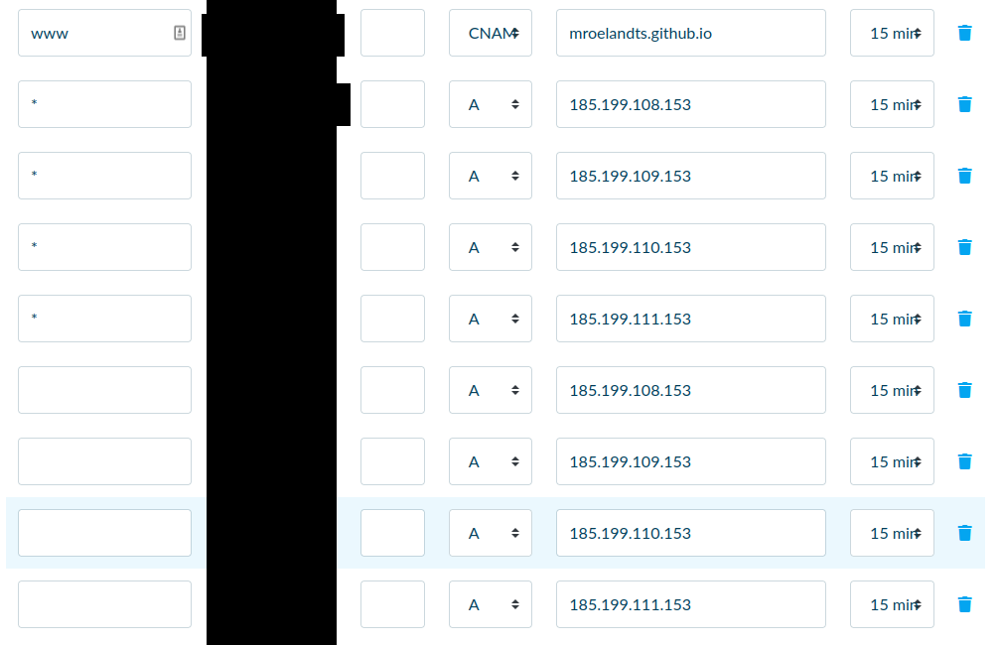

# Speculaas website

* [https://mroelandts.github.io/speculaas](https://mroelandts.github.io/speculaas/)
* [http://innerwheeldiest-speculaas.be/](http://innerwheeldiest-speculaas.be/)

## Github Pages
[Github pages setups](https://docs.github.com/en/free-pro-team@latest/github/working-with-github-pages/managing-a-custom-domain-for-your-github-pages-site)

Dont forget to add the CAME file.
